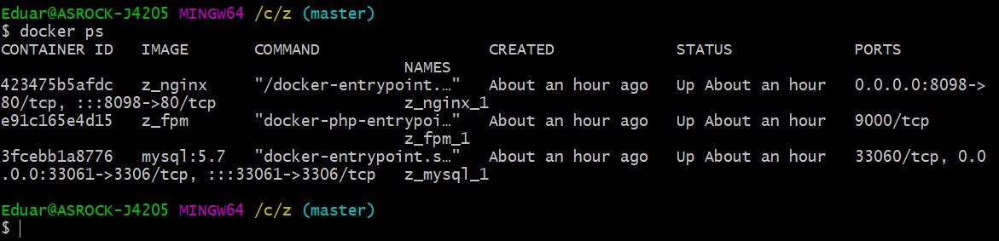
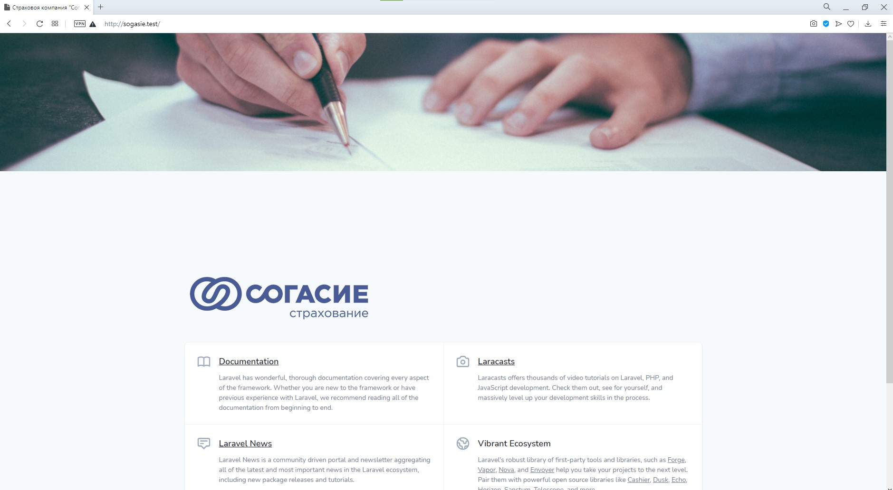

    

## Поднятие Laravel в docker

- >Склонируйте  [репозиторий](https://bitbucket.org/eduard-molchanov/sogasie/src/master/).
- >Откройте катлог с клоном в терминале.
- >выполните команду **composer update**.
- >переименуйте файл **.env.example** в **.env**
- >установите в файле **.env** следующие значения:

DB_HOST=mysql

DB_DATABASE=sogasie

DB_PASSWORD=root

- >выполните команду **php artisan key:generate**
- >выполните команду **docker-compose build**
- >выполните команду **docker-compose up -d**
- >выполните коанду **docker ps**
- > должно получиться примерно так:
  

- >в файле **hosts**  C:\Windows\System32\drivers\etc добавить запись   **127.0.0.1 sogasie.test**
- >в браузере перейдите по адресу [http://sogasie.test](http://sogasie.test/)
- > должно получиться  так:
  

## Добавление администратора в систему

- > добавить вручную в колонку **role** таблицы  **roles**  значения:
  > admin
  > user
  > guest
  > system
  
- >выполните команду **php artisan db:seed --class=UserSeeder**
- >выберите в таблице **users** пользователя со значением **roles_id** соответствующего администратору 
- >в верхнем меню сайта выберите **Обновить пароль** и смените пароль для выбранного вами пользователя
